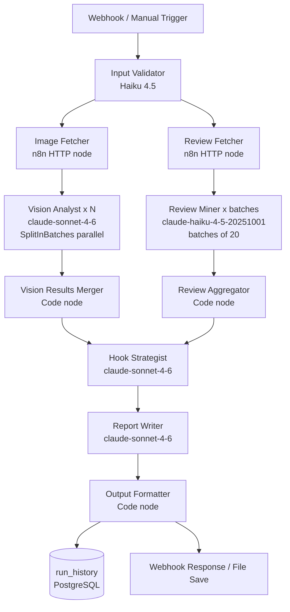

# Architecture

## Pipeline Diagram



## Model Tiering

| Node | Model | Input Tokens | Output Tokens | Cost/Run |
|------|-------|-------------|---------------|---------|
| Input Validator | Haiku 4.5 | ~500 | ~100 | ~$0.001 |
| Vision Analyst × 5 | Sonnet 4.6 | ~2,500 img + 900 sys × 5 | ~500 × 5 | ~$0.052 |
| Review Miner × 3 batches | Haiku 4.5 | ~700 sys + 800 batch × 3 | ~600 × 3 | ~$0.009 |
| Hook Strategist | Sonnet 4.6 | ~900 sys + 2,000 data | ~1,200 | ~$0.021 |
| Report Writer | Sonnet 4.6 | ~900 sys + 3,000 data | ~1,500 | ~$0.033 |
| **Total** | | | | **~$0.12/run** |

With prompt caching active on all system prompts.
Without tiering (all Sonnet): ~$0.30/run.

## Prompt Caching Strategy

Cache writes (first call per session):
- Vision Analyst system prompt: ~900 tokens → $3.75/MTok write rate
- Review Miner system prompt: ~700 tokens → $1.00/MTok write rate (Haiku)
- Hook Strategist + Report Writer: single calls, cache benefit on retries only

Cache reads (subsequent calls in same session):
- Vision Analyst calls 2–5: ~$0.30/MTok read rate (vs $3.00/MTok without cache)
- Review Miner batches 2–3: ~$0.08/MTok read rate (vs $0.80/MTok without cache)
- Cache TTL: 5 minutes

## Data Flow

```
RunInput (webhook JSON)
    └─> Vision Analyst → VisionAnalysisResult[]
    └─> Review Miner → ReviewBatchResult[]
            └─> Review Aggregator → AggregatedReviewIntelligence
                    └─> Hook Strategist → HooksResult
                            └─> Report Writer → brand_report (markdown)
                                    └─> Output Formatter → FinalOutput
                                            └─> run_history INSERT
                                            └─> Webhook response
```

Full envelope schema: `schemas/workflow_envelope.json`

## Infrastructure

```
VPS (Linux)
└── Docker
    ├── postgres:15-alpine
    │   └── Volume: postgres_data (n8n state + run_history)
    │   └── Network: n8n_internal (internal only — no external access)
    ├── n8nio/n8n:latest
    │   └── Bound to: 127.0.0.1:5678 (localhost only)
    │   └── Network: n8n_internal + n8n_external
    │   └── Volume: n8n_data, n8n_binary
    └── nginx:alpine (optional, --profile nginx)
        └── Ports: 80 (redirect), 443 (SSL termination)
        └── Proxies to: n8n:5678

Cron (host)
├── */5 * * * * scripts/health_check.sh → HEARTBEAT_URL
├── 0 2 * * * scripts/backup_workflows.sh → n8n/backup/
└── 0 3 * * 0 scripts/rotate_logs.sh
```

## Security Notes

- PostgreSQL never exposed outside Docker network (`internal: true`)
- n8n bound to `127.0.0.1:5678` — only reachable via nginx proxy
- Two-user PostgreSQL: admin user only used by init script, app user only has table-level grants
- All n8n telemetry disabled (`N8N_DIAGNOSTICS_ENABLED: false`)
- Anthropic API calls go directly VPS → `api.anthropic.com` (no proxy, no logging middleware)
